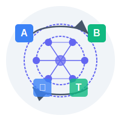

# AI Translation

Send the selected text to an OpenAI compatible LLM service, such as [OpenAI](https://platform.openai.com/docs/overview) or [Gaia](https://docs.gaianet.ai/getting-started/quick-start), for instant translation into your chosen language.

### Configuration

#### API Endpoint

* **Running your own Gaia node:** use `http://localhost:8080/v1`
* **Public Gaia node:** it could be something like `https://0x1234.gaia.domains/v1` -- the public address of your node
* **OpenAI:** defaults to `https://api.openai.com/v1`

#### API Key

* **Running your own Gaia node:** you can leave this empty.
* **Public Gaia node:** https://docs.gaianet.ai/getting-started/authentication
* **OpenAI API:** https://platform.openai.com/account/api-keys

#### Model Name

* **Gaia:** you can use `default`
* **OpenAI:** default model is `gpt-4o-mini`

#### Target Language

The default target language is `English`, feel free to change it into any language you like, such as `Simplified Chinese`.

## About

This is an extension for [PopClip](https://pilotmoon.com/popclip/).

### Requirements

Requires PopClip 2022.12 or later.

## Credit

### Icons

* Icon used in the PopClip Extension by [SVG Repo](https://www.svgrepo.com/svg/498497/translate)
* LOGO by [Claude](https://claude.ai/)
